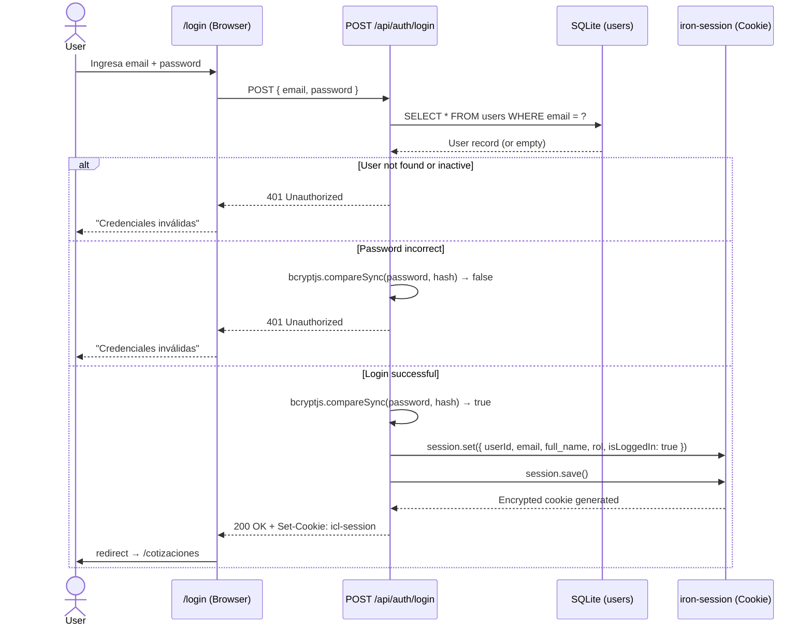
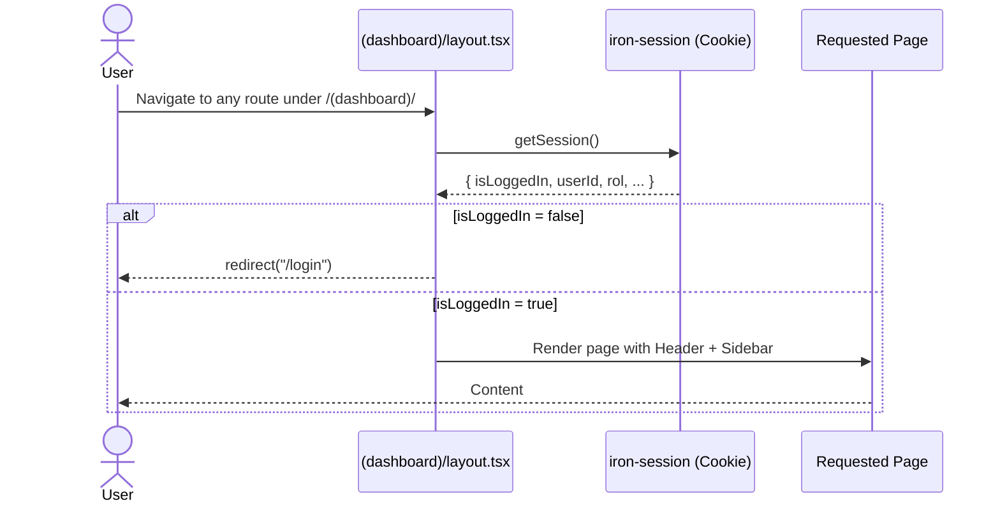
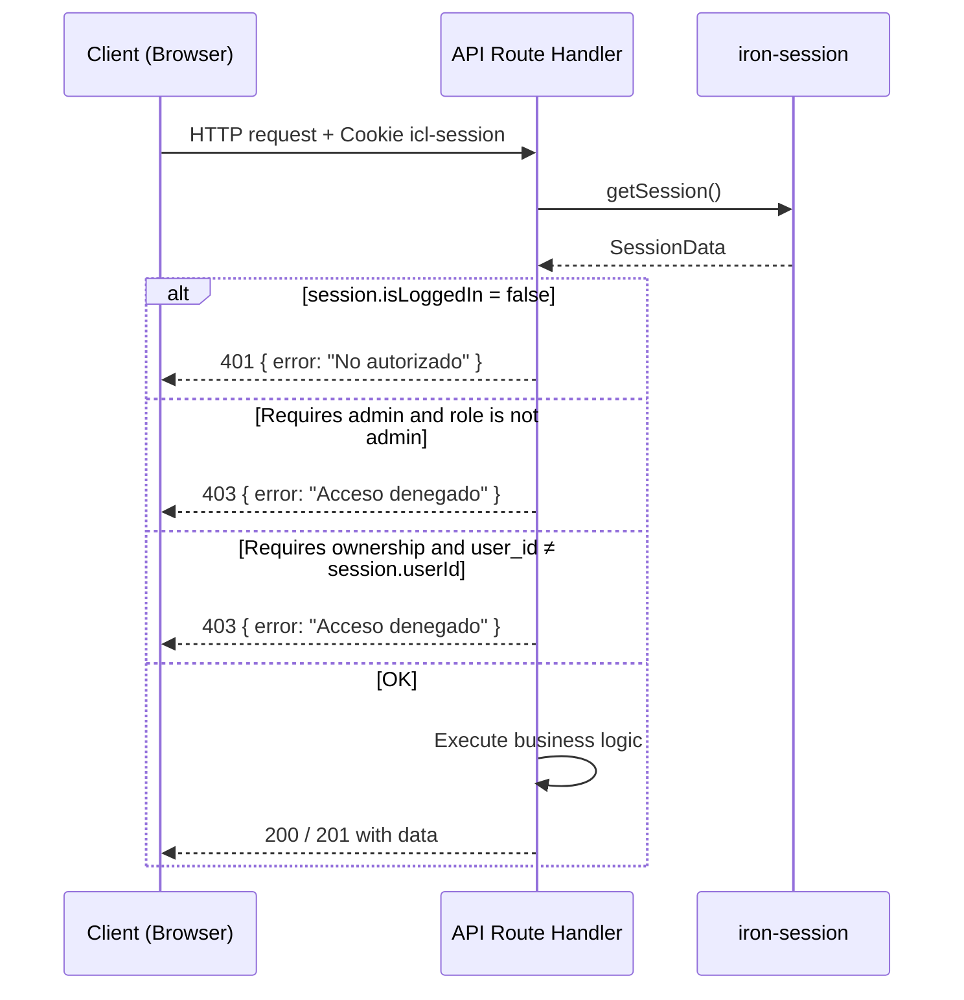
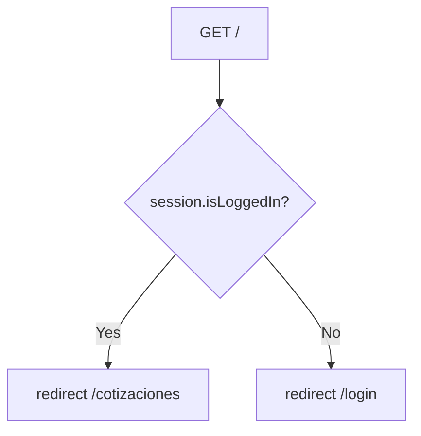

## Authentication Mechanism

ICL Cotizaciones uses **iron-session** for encrypted, stateless session management via HTTP-only cookies.

| Aspect | Implementation |
|--------|----------------|
| **Type** | Encrypted HTTP-only cookie (`iron-session` v8) |
| **Cookie name** | `icl-session` |
| **Encryption** | Symmetric AES with configurable password |
| **Password hashing** | `bcryptjs` with `compareSync()` |
| **Page guards** | Server-side redirect in `(dashboard)/layout.tsx` |
| **API guards** | Manual `session.isLoggedIn` check in each route handler |
| **Middleware** | **Not implemented** — no `middleware.ts` file |

<Warning>
  **Production Security Risks:**
  - Session encryption key is hardcoded in `src/lib/session.ts`
  - Should be moved to environment variable (`SESSION_PASSWORD`)
  - `secure: false` flag must be changed to `true` for HTTPS in production
</Warning>

## Session Configuration

The session is configured in `src/lib/session.ts:sessionOptions:14`:

```typescript
import { getIronSession, type SessionOptions } from "iron-session";
import { cookies } from "next/headers";
import type { UserRole } from "./utils";

export interface SessionData {
  userId: number;
  email: string;
  full_name: string;
  rol: UserRole;
  isLoggedIn: boolean;
}

export const sessionOptions: SessionOptions = {
  password: "icl-secret-key-at-least-32-characters-long!!",
  cookieName: "icl-session",
  cookieOptions: {
    secure: false, // localhost only
    httpOnly: true,
    sameSite: "lax",
  },
};

export async function getSession() {
  const cookieStore = await cookies();
  const session = await getIronSession<SessionData>(cookieStore, sessionOptions);
  return session;
}
```

<Note>
  The `secure: false` setting allows session cookies to work over HTTP during local development. **Always set to `true` in production.**
</Note>

## User Roles

Roles are defined in `src/lib/utils.ts:32` and stored in the `users.role` column.

| Role | Type | Capabilities |
|------|------|-------------|
| `DIRECTOR` | Admin | Full system access |
| `GERENTE` | Admin | Full system access |
| `ADMINISTRACION` | Admin | Full system access |
| `COMERCIAL` | Standard | Own quotations only |
| `OPERACIONES` | Standard | Own quotations only |

### Admin Check

```typescript
export type UserRole = "DIRECTOR" | "GERENTE" | "COMERCIAL" | "ADMINISTRACION" | "OPERACIONES";

export const ADMIN_ROLES: UserRole[] = ["DIRECTOR", "GERENTE", "ADMINISTRACION"];

export function isAdmin(rol: UserRole): boolean {
  return ADMIN_ROLES.includes(rol);
}
```

The `isAdmin()` function is used throughout API routes to restrict access to master data mutations.

## Authentication Flows

### Login Flow



### Page Guard (Layout-Based)

All protected routes under `(dashboard)/` are guarded by the layout server component.



**Implementation:**

```typescript
// src/app/(dashboard)/layout.tsx
import { redirect } from "next/navigation";
import { getSession } from "@/lib/session";

export default async function DashboardLayout({
  children,
}: {
  children: React.ReactNode;
}) {
  const session = await getSession();

  if (!session.isLoggedIn) {
    redirect("/login");
  }

  return (
    <div>
      <Header user={session} />
      <Sidebar role={session.rol} />
      <main>{children}</main>
    </div>
  );
}
```

### API Route Guard

API routes manually check session status and authorization.



**Example API Guard:**

```typescript
// src/app/api/clientes/route.ts
import { getSession } from "@/lib/session";
import { isAdmin } from "@/lib/utils";
import { NextResponse } from "next/server";

export async function POST(request: Request) {
  const session = await getSession();

  if (!session.isLoggedIn) {
    return NextResponse.json(
      { error: "No autorizado" },
      { status: 401 }
    );
  }

  if (!isAdmin(session.rol)) {
    return NextResponse.json(
      { error: "Acceso denegado" },
      { status: 403 }
    );
  }

  // ... business logic
}
```

### Logout Flow

```mermaid
sequenceDiagram
    actor U as User
    participant H as Header (Browser)
    participant A as POST /api/auth/logout
    participant S as iron-session

    U->>H: Click "Cerrar sesión"
    H->>A: POST /api/auth/logout
    A->>S: session.destroy()
    S-->>A: Cookie cleared (Set-Cookie: icl-session=; Max-Age=0)
    A-->>H: 200 { ok: true }
    H->>U: redirect → /login
```

## Root Page Redirect

The root page (`/`) redirects based on session status.



**Implementation:**

```typescript
// src/app/page.tsx
import { redirect } from "next/navigation";
import { getSession } from "@/lib/session";

export default async function HomePage() {
  const session = await getSession();
  
  if (session.isLoggedIn) {
    redirect("/cotizaciones");
  } else {
    redirect("/login");
  }
}
```

## Authorization Patterns

### Admin-Only Endpoints

Master data endpoints (clients, users, locations, agreements, pricing) require admin role.

```typescript
import { getSession } from "@/lib/session";
import { isAdmin } from "@/lib/utils";

export async function POST(request: Request) {
  const session = await getSession();

  if (!session.isLoggedIn) {
    return NextResponse.json({ error: "No autorizado" }, { status: 401 });
  }

  if (!isAdmin(session.rol)) {
    return NextResponse.json({ error: "Acceso denegado" }, { status: 403 });
  }

  // ... mutation logic
}
```

### Ownership-Based Access

Non-admin users can only access their own quotations.

```typescript
// GET /api/cotizaciones
export async function GET(request: Request) {
  const session = await getSession();

  if (!session.isLoggedIn) {
    return NextResponse.json({ error: "No autorizado" }, { status: 401 });
  }

  let quotations;
  
  if (isAdmin(session.rol)) {
    // Admins see all quotations
    quotations = await db.select().from(quotationsTable);
  } else {
    // Non-admins see only their own
    quotations = await db
      .select()
      .from(quotationsTable)
      .where(eq(quotationsTable.user_id, session.userId));
  }

  return NextResponse.json(quotations);
}
```

### UI Access Control

The sidebar conditionally shows master data sections based on role.

```typescript
// src/components/Sidebar.tsx
import { isAdmin } from "@/lib/utils";

interface SidebarProps {
  role: UserRole;
}

export function Sidebar({ role }: SidebarProps) {
  const showMaestros = isAdmin(role);

  return (
    <nav>
      <NavLink href="/cotizaciones">Cotizaciones</NavLink>
      <NavLink href="/dashboard/general">Dashboard</NavLink>
      
      {showMaestros && (
        <NavGroup title="Maestros">
          <NavLink href="/maestros/clientes">Clientes</NavLink>
          <NavLink href="/maestros/usuarios">Usuarios</NavLink>
          <NavLink href="/maestros/locaciones">Locaciones</NavLink>
          {/* ... more master data links */}
        </NavGroup>
      )}
    </nav>
  );
}
```

<Note>
  Pages themselves are client components without built-in guards. **Effective protection is enforced at the API level.** Non-admin users who manually navigate to `/maestros/*` URLs will see the page but cannot mutate data.
</Note>

## Security Considerations

<AccordionGroup>
  <Accordion title="CSRF Protection">
    iron-session with `sameSite: "lax"` provides automatic CSRF protection for most cross-site attacks. For additional protection in production, consider implementing CSRF tokens for state-changing operations.
  </Accordion>

  <Accordion title="Password Security">
    Passwords are hashed with `bcryptjs` before storage. Never log or expose password hashes. Use strong password requirements in production (minimum length, complexity rules).
  </Accordion>

  <Accordion title="Session Expiration">
    iron-session supports `maxAge` for automatic session expiration. Currently not configured — sessions persist until browser close or manual logout. Consider adding `maxAge: 60 * 60 * 24 * 7` (7 days) for production.
  </Accordion>

  <Accordion title="Secure Flag">
    The `secure: false` cookie flag **must be changed to `true`** in production to prevent session hijacking over unencrypted connections.
  </Accordion>

  <Accordion title="Environment Variables">
    Move the session password from hardcoded value to environment variable:
    
    ```typescript
    password: process.env.SESSION_PASSWORD || "fallback-dev-key",
    ```
    
    Generate a secure random key with:
    ```bash
    openssl rand -base64 32
    ```
  </Accordion>
</AccordionGroup>

## API Endpoints

| Endpoint | Methods | Access Control |
|----------|---------|----------------|
| `/api/auth/login` | POST | Public |
| `/api/auth/logout` | POST | Authenticated |
| `/api/auth/me` | GET | Authenticated |
| `/api/cotizaciones` | GET | Filtered by `user_id` for non-admin |
| `/api/cotizaciones` | POST | Any authenticated user |
| `/api/cotizaciones/[id]` | GET, PUT, DELETE | Owner or admin |
| `/api/clientes` | GET | Any authenticated user |
| `/api/clientes` | POST, PUT, DELETE | Admin only |
| `/api/usuarios` | GET, POST, PUT, DELETE | Admin only |
| All `/api/maestros/*` | POST, PUT, DELETE | Admin only |

## Related Documentation

<CardGroup cols={2}>
  <Card title="Session Config" icon="file-code" href="https://github.com/yourusername/icl-app/blob/main/src/lib/session.ts">
    View session configuration in `src/lib/session.ts`
  </Card>
  <Card title="Utils" icon="wrench" href="https://github.com/yourusername/icl-app/blob/main/src/lib/utils.ts">
    See `isAdmin()` and role types in `src/lib/utils.ts`
  </Card>
  <Card title="API Reference" icon="brackets-curly" href="/api/auth/login">
    Explore authentication API endpoints
  </Card>
  <Card title="iron-session Docs" icon="book" href="https://github.com/vvo/iron-session">
    Official iron-session documentation
  </Card>
</CardGroup>