## Overview

ICL Cotizaciones uses **SQLite** as the embedded relational database with **Drizzle ORM** for type-safe schema definitions and queries.

- **Source of truth:** `src/db/schema.ts` (Drizzle ORM)
- **Database file:** `data/icl.db`
- **Journal mode:** WAL (Write-Ahead Logging)
- **Foreign keys:** Enabled (`foreign_keys = ON`)

<Note>
  **v2 Refactor (branch `refactor/core-model`):** Tables and columns renamed to English. `origenes` + `vias` merged into a single `locations` table with `location_type` discriminator.
</Note>

## Entity Relationship Diagram

```mermaid
erDiagram
    users {
        integer id PK
        text full_name
        text email UK
        text password
        text role
        integer is_active
        text dni
        text created_at
        text updated_at
    }

    clients {
        integer id PK
        text legal_name
        text tax_id
        text phone
        text email
        text client_type
        integer user_id FK
        integer is_active
        text created_at
        text updated_at
    }

    locations {
        integer id PK
        text name
        text country
        text region
        text location_type
        integer is_active
    }

    commercial_agreements {
        integer id PK
        integer client_id FK
        text end_client
        text currency
        text rate_schedule
        text deconsolidation_wm
        real deconsolidation_min
        real deconsolidation_max
        text deconsolidation_notes
        real agp_per_ton
        real document_handling
        real log_fee
        real doc_fee
        real freight_cert
        real insurance_pct
        real insurance_min
        real bl_emission
        text payment_terms
        real max_discount
        real commission
        real incentive
        text quote_data
        text notes
        integer user_id FK
        text last_modified
        text fiscal_rate_schedule
        text created_at
        text updated_at
    }

    quotations {
        integer id PK
        text quote_number UK
        text date
        text time
        text impo_expo
        text tipo
        text load_type
        text sale_condition
        integer client_id FK
        integer origin_id FK
        integer via_id FK
        text end_client
        real kgs
        real billable_cbm
        real actual_cbm
        text description
        text imo
        text stackable
        text pickup_address
        text currency
        real origin_costs_net
        real origin_costs_sale
        real freight_net
        real freight_sale
        text freight_net_type
        text freight_sale_type
        text status
        text close_date
        text sales_order
        text notes
        text reference
        text rate_validity
        real profit
        integer month
        integer year
        integer week
        integer user_id FK
        text created_at
        text updated_at
    }

    pricing_netos {
        integer id PK
        text region
        text country
        text port
        text tipo
        text currency
        real freight_net
        real first_leg
        real net_container
        real net_m3
        real rebate
        real net_total
        text valid_from
        text valid_until
        text created_at
        text updated_at
    }

    port_rates {
        integer id PK
        text region
        text country
        text port_of_loading
        real rate_0_3_cbm
        real rate_3_5_cbm
        real rate_5_10_cbm
        real rate_10_15_cbm
        real gri
        real minimum
        text via
        text transit_time
        text valid_from
        text valid_until
        text created_at
        text updated_at
    }

    users ||--o{ clients : "user_id"
    users ||--o{ commercial_agreements : "user_id"
    users ||--o{ quotations : "user_id"
    clients ||--o{ commercial_agreements : "client_id"
    clients ||--o{ quotations : "client_id"
    locations ||--o{ quotations : "origin_id"
    locations ||--o{ quotations : "via_id"
```



<Note>
  `locations` joins to `quotations` twice: once as origin (`origin_id`) and once as route (`via_id`). The `location_type` field is either `'origen'` or `'via'`.
</Note>

## Table Schemas

### users

User accounts with role-based access control.

```typescript
export const users = sqliteTable("users", {
  id: integer("id").primaryKey({ autoIncrement: true }),
  full_name: text("full_name").notNull(),
  email: text("email").notNull().unique(),
  password: text("password").notNull(),
  role: text("role", { 
    enum: ["DIRECTOR", "GERENTE", "COMERCIAL", "CSV", "OPERACIONES", "ADMINISTRACION"] 
  }).notNull(),
  is_active: integer("is_active", { mode: "boolean" }).notNull().default(true),
  dni: text("dni"),
  created_at: text("created_at").notNull().default("(datetime('now'))"),
  updated_at: text("updated_at").notNull().default("(datetime('now'))"),
});
```

<Tabs>
  <Tab title="Roles">
    | Role | Type | Description |
    |------|------|-------------|
    | `DIRECTOR` | Admin | Full system access |
    | `GERENTE` | Admin | Full system access |
    | `ADMINISTRACION` | Admin | Full system access |
    | `COMERCIAL` | Standard | Access to own quotations only |
    | `OPERACIONES` | Standard | Access to own quotations only |
    | `CSV` | Standard | Limited access (deprecated role) |
  </Tab>
  <Tab title="Constraints">
    - `id`: Auto-increment primary key
    - `email`: Unique constraint
    - `password`: Hashed with bcryptjs
    - `is_active`: Boolean (0/1 in SQLite)
  </Tab>
</Tabs>

### clients

Client companies with optional user assignment.

```typescript
export const clients = sqliteTable("clients", {
  id: integer("id").primaryKey({ autoIncrement: true }),
  legal_name: text("legal_name").notNull(),
  tax_id: text("tax_id"),
  phone: text("phone"),
  email: text("email"),
  client_type: text("client_type", { 
    enum: ["FFWW", "Final", "Both"] 
  }).notNull().default("FFWW"),
  user_id: integer("user_id").references(() => users.id),
  is_active: integer("is_active", { mode: "boolean" }).notNull().default(true),
  created_at: text("created_at").notNull().default("(datetime('now'))"),
  updated_at: text("updated_at").notNull().default("(datetime('now'))"),
});
```

**Client Types:**
- `FFWW`: Freight forwarder
- `Final`: End client
- `Both`: Both freight forwarder and end client

### locations

Unified table for origins and transit routes (via points).

```typescript
export const locations = sqliteTable("locations", {
  id: integer("id").primaryKey({ autoIncrement: true }),
  name: text("name").notNull(),
  country: text("country").notNull(),
  region: text("region"),
  location_type: text("location_type", { 
    enum: ["origen", "via"] 
  }).notNull(),
  is_active: integer("is_active", { mode: "boolean" }).notNull().default(true),
});
```

<Warning>
  The `location_type` discriminator determines whether a location is an origin (`'origen'`) or a transit route (`'via'`). APIs `/api/origenes` and `/api/vias` filter by this field internally.
</Warning>

### commercial_agreements

Commercial terms and pricing agreements per client.

```typescript
export const commercial_agreements = sqliteTable("commercial_agreements", {
  id: integer("id").primaryKey({ autoIncrement: true }),
  client_id: integer("client_id").references(() => clients.id),
  end_client: text("end_client"),
  rate_schedule: text("rate_schedule"),
  deconsolidation_wm: text("deconsolidation_wm"),
  deconsolidation_min: real("deconsolidation_min"),
  deconsolidation_max: real("deconsolidation_max"),
  deconsolidation_notes: text("deconsolidation_notes"),
  agp_per_ton: real("agp_per_ton"),
  document_handling: real("document_handling"),
  log_fee: real("log_fee"),
  doc_fee: real("doc_fee"),
  freight_cert: real("freight_cert"),
  insurance_pct: real("insurance_pct"),
  insurance_min: real("insurance_min"),
  bl_emission: real("bl_emission"),
  payment_terms: text("payment_terms"),
  max_discount: real("max_discount"),
  commission: real("commission"),
  incentive: real("incentive"),
  quote_data: text("quote_data"),
  notes: text("notes"),
  user_id: integer("user_id").references(() => users.id),
  last_modified: text("last_modified"),
  fiscal_rate_schedule: text("fiscal_rate_schedule"),
  currency: text("currency", { enum: ["USD", "EUR", "ARS"] }).default("USD"),
  created_at: text("created_at").notNull().default("(datetime('now'))"),
  updated_at: text("updated_at").notNull().default("(datetime('now'))"),
});
```

### quotations

Core entity: freight quotations with operation, route, cargo, and financial details.

```typescript
export const quotations = sqliteTable("quotations", {
  id: integer("id").primaryKey({ autoIncrement: true }),
  quote_number: text("quote_number").notNull().unique(),
  date: text("date").notNull(),
  time: text("time"),

  // Operation
  impo_expo: text("impo_expo", { enum: ["IMPO", "EXPO"] }).notNull().default("IMPO"),
  tipo: text("tipo"),
  load_type: text("load_type", { enum: ["FCL", "LCL"] }).notNull().default("LCL"),
  sale_condition: text("sale_condition"),

  // Route
  client_id: integer("client_id").references(() => clients.id),
  origin_id: integer("origin_id").references(() => locations.id),
  via_id: integer("via_id").references(() => locations.id),
  end_client: text("end_client"),

  // Cargo
  kgs: real("kgs"),
  billable_cbm: real("billable_cbm"),
  actual_cbm: real("actual_cbm"),
  description: text("description"),
  imo: text("imo"),
  stackable: text("stackable", { enum: ["SI", "NO"] }),
  pickup_address: text("pickup_address"),

  // Financial
  currency: text("currency", { enum: ["USD", "EUR", "ARS"] }).notNull().default("USD"),
  origin_costs_net: real("origin_costs_net"),
  origin_costs_sale: real("origin_costs_sale"),
  freight_net: real("freight_net"),
  freight_sale: real("freight_sale"),
  freight_net_type: text("freight_net_type"),
  freight_sale_type: text("freight_sale_type"),

  // Status
  status: text("status", { 
    enum: ["SI", "NO", "PEND", "ENCOTIZACION", "PEND A/C"] 
  }).notNull().default("ENCOTIZACION"),
  close_date: text("close_date"),
  sales_order: text("sales_order"),

  // Text
  notes: text("notes"),
  reference: text("reference"),

  // Validity
  rate_validity: text("rate_validity"),

  // Computed
  profit: real("profit"),
  month: integer("month"),
  year: integer("year"),
  week: integer("week"),

  // Metadata
  user_id: integer("user_id").references(() => users.id),
  created_at: text("created_at").notNull().default("(datetime('now'))"),
  updated_at: text("updated_at").notNull().default("(datetime('now'))"),
});
```

<Tabs>
  <Tab title="Status Values">
    | Status | Meaning |
    |--------|----------|
    | `ENCOTIZACION` | Quote in progress (default) |
    | `SI` | Won/Confirmed |
    | `NO` | Lost |
    | `PEND` | Pending |
    | `PEND A/C` | Pending client approval |
  </Tab>
  <Tab title="Computed Fields">
    These fields are automatically calculated by the server on create/update:
    
    - `profit = (freight_sale - freight_net) + (origin_costs_sale - origin_costs_net)`
    - `month`, `year`, `week`: Derived from `date` field
    
    See `src/lib/utils.ts:getWeekNumber()` for week calculation.
  </Tab>
</Tabs>

### pricing_netos

Unified pricing table for FCL and LCL net rates by route and validity period.

```typescript
export const pricing_netos = sqliteTable("pricing_netos", {
  id: integer("id").primaryKey({ autoIncrement: true }),
  region: text("region").notNull(),
  country: text("country").notNull(),
  port: text("port").notNull(),
  tipo: text("tipo", { 
    enum: ["LCL", "20'", "40'", "40'HQ"] 
  }).notNull(),
  currency: text("currency", { enum: ["USD", "EUR"] }).notNull().default("USD"),
  freight_net: real("freight_net").notNull(),
  first_leg: real("first_leg"),
  net_container: real("net_container").notNull(),
  net_m3: real("net_m3").notNull(),
  rebate: real("rebate"),
  net_total: real("net_total").notNull(),
  valid_from: text("valid_from").notNull(),
  valid_until: text("valid_until").notNull(),
  created_at: text("created_at").notNull().default("(datetime('now'))"),
  updated_at: text("updated_at").notNull().default("(datetime('now'))"),
});
```

**Computed columns (pre-calculated by server):**

```typescript
// net_container = freight_net + (first_leg ?? 0) * 50
// net_m3 = tipo === "20'" ? net_container/50-2 
//        : tipo === "40'" ? net_container/50-4 
//        : net_container/50
// net_total = net_m3 + (rebate ?? 0)
```

### port_rates

Base rates per port of loading with tiered pricing by CBM volume.

```typescript
export const port_rates = sqliteTable("port_rates", {
  id: integer("id").primaryKey({ autoIncrement: true }),
  region: text("region").notNull(),
  country: text("country").notNull(),
  port_of_loading: text("port_of_loading").notNull(),
  rate_0_3_cbm: real("rate_0_3_cbm").notNull(),
  rate_3_5_cbm: real("rate_3_5_cbm").notNull(),
  rate_5_10_cbm: real("rate_5_10_cbm").notNull(),
  rate_10_15_cbm: real("rate_10_15_cbm").notNull(),
  gri: text("gri"),
  minimum: real("minimum"),
  via: text("via"),
  currency: text("currency", { enum: ["ARS", "USD", "EUR"] }).notNull().default("USD"),
  transit_time: text("transit_time"),
  valid_from: text("valid_from").notNull(),
  valid_until: text("valid_until").notNull(),
  created_at: text("created_at").notNull().default("(datetime('now'))"),
  updated_at: text("updated_at").notNull().default("(datetime('now'))"),
});
```

## Catalog Tables (No Foreign Keys)

<Note>
  `pricing_netos` and `port_rates` are catalog tables without formal foreign key constraints. They use text fields for locations that implicitly reference `locations.name`.
</Note>

### Implicit Relationships

| Catalog Table | Field | Implicit Reference | Usage |
|---------------|-------|-------------------|-------|
| `port_rates` | `port_of_loading` | `locations.name` (where `location_type='via'`) | Auto-suggest `quotations.freight_net` when `load_type='LCL'` |
| `pricing_netos` | `port` | `locations.name` (where `location_type='via'`) | Pricing form uses `locations` for cascading Region → Country → Via dropdowns |

## Design Notes

<AccordionGroup>
  <Accordion title="Primary Keys">
    All IDs are `INTEGER PRIMARY KEY AUTOINCREMENT`.
  </Accordion>

  <Accordion title="Date Storage">
    All dates are stored as `TEXT` in ISO 8601 format (`YYYY-MM-DD`). Timestamps (`created_at`, `updated_at`) are also `TEXT`.
  </Accordion>

  <Accordion title="Boolean Fields">
    `is_active` fields are `INTEGER` with `mode: "boolean"` in Drizzle (stored as 0/1 in SQLite).
  </Accordion>

  <Accordion title="Computed Quotation Fields">
    - `quotations.profit` is calculated server-side on every POST/PUT
    - `quotations.month`, `year`, `week` are derived from `quotations.date` on the server
  </Accordion>

  <Accordion title="Location Type Discriminator">
    `locations.location_type` discriminates between origins (`'origen'`) and transit routes (`'via'`). APIs `/api/origenes` and `/api/vias` filter by this field internally.
  </Accordion>
</AccordionGroup>

## Related Documentation

<CardGroup cols={2}>
  <Card title="Schema Definition" icon="code" href="https://github.com/yourusername/icl-app/blob/main/src/db/schema.ts">
    View the complete Drizzle schema in `src/db/schema.ts`
  </Card>
  <Card title="API Reference" icon="brackets-curly" href="/api/auth/login">
    Explore API endpoints for each table
  </Card>
  <Card title="Migrations" icon="database" href="/operations/database-management">
    Learn about database migrations with drizzle-kit
  </Card>
  <Card title="Seed Data" icon="seedling" href="/operations/database-management">
    Run `npm run db:seed` to populate test data
  </Card>
</CardGroup>