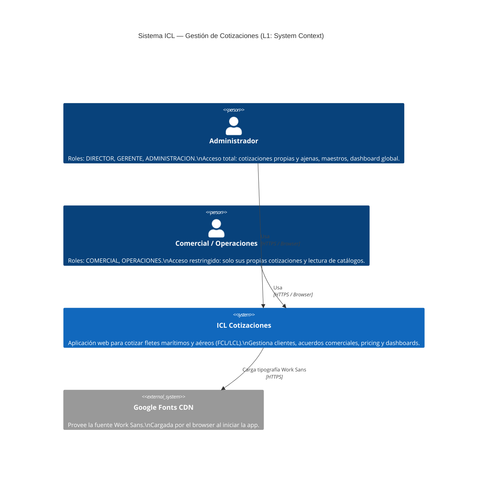
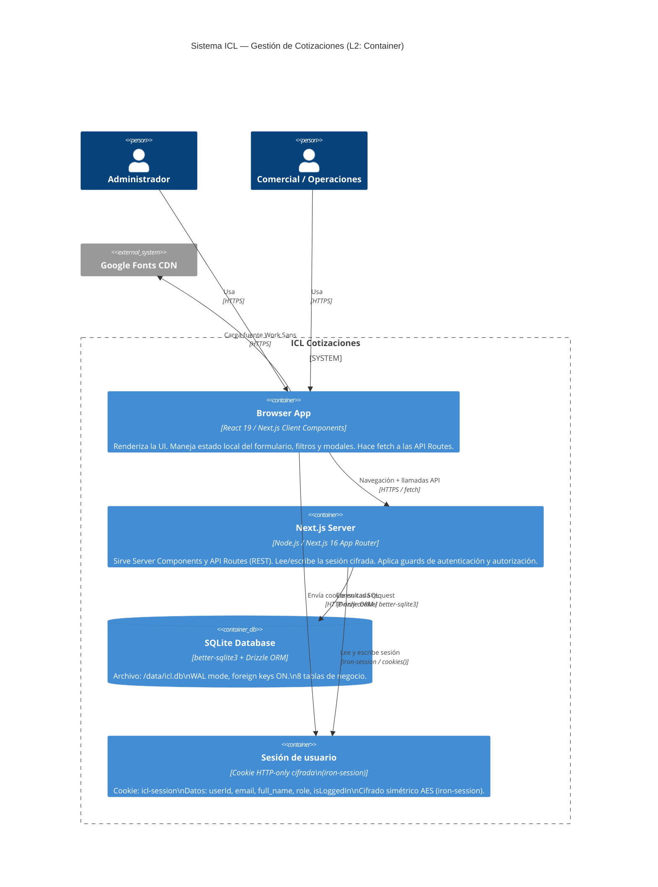

## System Overview

ICL Cotizaciones is a freight quotation management SaaS application built with Next.js 16 App Router, React 19, and SQLite. The system enables freight forwarders to manage client quotes for maritime and air freight (FCL/LCL), commercial agreements, pricing catalogs, and analytics dashboards.

<Note>
  The application uses a monolithic architecture with server-side rendering, API routes, and an embedded SQLite database with WAL mode for concurrent access.
</Note>

## Tech Stack

### Frontend

| Technology | Version | Purpose |
|------------|---------|----------|
| **React** | 19.2.4 | UI rendering and client components |
| **Next.js** | 16.1.6 | Full-stack framework with App Router |
| **Tailwind CSS** | 4.1.18 | Utility-first styling |
| **Radix UI** | Various | Headless accessible components (Dialog, Select, Dropdown, etc.) |
| **Recharts** | 3.7.0 | Dashboard charts and data visualization |
| **Lucide React** | 0.564.0 | Icon library |
| **TanStack Table** | 8.21.3 | Data table management |

### Backend

| Technology | Version | Purpose |
|------------|---------|----------|
| **Node.js** | — | Server runtime |
| **Next.js API Routes** | 16.1.6 | RESTful API endpoints |
| **iron-session** | 8.0.4 | Encrypted HTTP-only session cookies |
| **bcryptjs** | 3.0.3 | Password hashing |

### Database

| Technology | Version | Purpose |
|------------|---------|----------|
| **SQLite** | — | Embedded relational database |
| **better-sqlite3** | 12.6.2 | Native SQLite binding for Node.js |
| **Drizzle ORM** | 0.45.1 | Type-safe ORM and query builder |
| **drizzle-kit** | 0.31.9 | Schema migration tool |

<Warning>
  The application uses `better-sqlite3` which requires native compilation. Ensure you configure `serverExternalPackages: ["better-sqlite3"]` in `next.config.ts`.
</Warning>

### Development Tools

- **TypeScript** 5.9.3
- **ESLint** 9.39.2 with Next.js config
- **tsx** 4.21.0 for running TypeScript scripts
- **Turbopack** for fast development builds

## C4 Model Diagrams

### Level 1: System Context

Shows the system as a black box and its relationships with actors and external systems.



#### Actors

| Actor | Roles | Capabilities |
|-------|-------|-------------|
| **Administrator** | `DIRECTOR`, `GERENTE`, `ADMINISTRACION` | Full CRUD on all quotations, master data management, global dashboard, user management |
| **Commercial / Operations** | `COMERCIAL`, `OPERACIONES` | CRUD on own quotations, read-only access to catalogs (clients, origins, routes, agreements, pricing) |

#### External Systems

| System | Purpose | Integration Type |
|--------|---------|------------------|
| **Google Fonts CDN** | Provides Work Sans font for UI | CDN HTTP — loaded in browser from root layout |

<Note>
  The system has no external integrations for email, cloud storage, payments, or third-party authentication providers.
</Note>

### Level 2: Container

Shows the containers (processes/stores) that compose the system.



## Container Details

### Browser App

- **Technology:** React 19, Next.js Client Components (`"use client"`)
- **Responsibilities:** UI rendering, form state management, filters, modals, API route fetching
- **Notes:** Does not access the database directly. All mutations go through API Routes.

### Next.js Server

- **Technology:** Node.js, Next.js 16 App Router
- **Responsibilities:**
  - Serve Server Components (layouts, pages with `redirect`)
  - Expose RESTful API Routes (`/api/**`)
  - Read/write encrypted session via `iron-session`
  - Apply authentication guards (layout redirect) and authorization (`isAdmin` in API)
- **Configuration:** `serverExternalPackages: ["better-sqlite3"]` in `next.config.ts`

### SQLite Database

- **Technology:** `better-sqlite3` (native binding), `drizzle-orm`
- **Location:** `{cwd}/data/icl.db`
- **Pragmas:** `journal_mode = WAL`, `foreign_keys = ON`
- **Tables:** 8 business tables (see [Database Schema](/architecture/database-schema))

### User Session

- **Technology:** `iron-session` v8
- **Transport:** HTTP-only cookie (`icl-session`)
- **Flags:** `httpOnly: true`, `sameSite: lax`, `secure: false` (localhost)
- **Payload:** `{ userId, email, full_name, role, isLoggedIn }`

<Warning>
  Production deployment requires:
  - Moving the session encryption key from hardcoded value to environment variable
  - Setting `secure: true` for HTTPS connections
</Warning>

## Database Tables Summary

| Table | Purpose | Key Relationships |
|-------|---------|------------------|
| `users` | User accounts with roles | — |
| `clients` | Client companies (FFWW, Final, Both types) | `user_id → users.id` |
| `locations` | Origins and routes unified by `location_type` | — |
| `quotations` | Freight quotations (core entity) | `client_id → clients.id`, `origin_id → locations.id`, `via_id → locations.id`, `user_id → users.id` |
| `commercial_agreements` | Commercial terms per client | `client_id → clients.id`, `user_id → users.id` |
| `pricing_netos` | Unified FCL + LCL net rates by route and period | — |
| `port_rates` | Base rates per port of loading | — |

<Note>
  Calculated fields in `quotations`: `profit = (freight_sale - freight_net) + (origin_costs_sale - origin_costs_net)`, plus `month`, `year`, `week` derived from `date` on the server.
</Note>

## Project Structure

```
src/
├── app/                          # Next.js App Router
│   ├── layout.tsx               # Root layout (HTML, Work Sans font)
│   ├── page.tsx                 # Redirect logic based on session
│   ├── login/                   # Login page
│   ├── (dashboard)/             # Protected route group
│   │   ├── layout.tsx          # Auth guard + Header + Sidebar
│   │   ├── cotizaciones/       # Quotations pages
│   │   ├── dashboard/          # Analytics dashboards
│   │   └── maestros/           # Master data pages
│   └── api/                     # API Routes
│       ├── auth/               # Authentication endpoints
│       ├── cotizaciones/       # Quotations CRUD
│       ├── clientes/           # Clients CRUD
│       ├── usuarios/           # Users CRUD
│       └── ...
├── components/                  # React components
│   ├── ui/                     # Reusable UI components
│   └── ...
├── db/
│   ├── schema.ts               # Drizzle schema definitions
│   ├── db.ts                   # Database connection
│   └── seed.ts                 # Seed data script
└── lib/
    ├── session.ts              # iron-session configuration
    └── utils.ts                # Utility functions (isAdmin, etc.)
```

## Key Design Decisions

<AccordionGroup>
  <Accordion title="Why SQLite instead of PostgreSQL/MySQL?">
    SQLite provides:
    - Zero-configuration embedded database
    - Single-file deployment simplicity
    - Excellent performance for single-server deployments
    - ACID compliance with WAL mode
    - Suitable for low-to-medium concurrent users
    
    Trade-off: Not suitable for multi-server horizontal scaling without read replicas.
  </Accordion>

  <Accordion title="Why iron-session instead of JWT?">
    iron-session offers:
    - Encrypted session data stored in HTTP-only cookies
    - No need for Redis or session store
    - Automatic CSRF protection with `sameSite: lax`
    - Stateless session management
    - Simpler than OAuth for internal applications
  </Accordion>

  <Accordion title="Why Next.js App Router?">
    App Router provides:
    - Server Components for reduced JavaScript bundle size
    - Simplified data fetching with async/await
    - Layout-based authentication guards
    - Co-located API routes with frontend code
    - Automatic code splitting and optimization
  </Accordion>

  <Accordion title="Why Drizzle ORM?">
    Drizzle offers:
    - Type-safe schema definitions with TypeScript
    - Lightweight runtime (no runtime schema validation overhead)
    - SQL-like query builder
    - Excellent SQLite support
    - Migration tooling with drizzle-kit
  </Accordion>
</AccordionGroup>

## Next Steps

<CardGroup cols={2}>
  <Card title="Database Schema" icon="database" href="/architecture/database-schema">
    Explore the complete database schema with ERD diagrams
  </Card>
  <Card title="Authentication" icon="lock" href="/architecture/authentication">
    Learn about iron-session, roles, and authorization guards
  </Card>
  <Card title="Routing" icon="route" href="/architecture/routing">
    Understand the Next.js App Router structure and API routes
  </Card>
  <Card title="API Reference" icon="code" href="/api/auth/login">
    Browse the complete API documentation
  </Card>
</CardGroup>