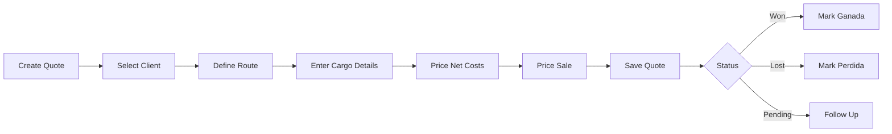

## Welcome to ICL Cotizaciones

ICL Cotizaciones is a comprehensive freight quotation management SaaS platform designed for international logistics operations. Built with Next.js 16 and modern web technologies, it streamlines the entire quotation lifecycle from creation to closing.

<CardGroup cols={2}>
  <Card
    title="Quickstart"
    icon="rocket"
    href="/quickstart"
  >
    Get up and running in 5 minutes with your first quotation
  </Card>
  <Card
    title="Installation"
    icon="download"
    href="/installation"
  >
    Detailed setup instructions for development and production
  </Card>
  <Card
    title="User Roles"
    icon="users"
    href="/guides/user-roles"
  >
    Understanding the 6 role-based access control levels
  </Card>
  <Card
    title="Quotation Management"
    icon="file-invoice"
    href="/features/quotations"
  >
    Create and manage FCL/LCL freight quotations
  </Card>
</CardGroup>

## Key Features

<AccordionGroup>
  <Accordion title="Role-Based Access Control">
    Six distinct roles with granular permissions:
    - **DIRECTOR**: Full system access and administrative control
    - **GERENTE**: Management-level access to all quotations
    - **ADMINISTRACION**: Administrative functions and reporting
    - **COMERCIAL**: Sales representatives managing their own quotations
    - **CSV**: Customer service operations
    - **OPERACIONES**: Operations team with quotation visibility

    Non-admin roles (COMERCIAL, CSV, OPERACIONES) see only quotations assigned to them, ensuring data privacy and focused workflows.
  </Accordion>

  <Accordion title="Freight Quotation Management">
    Complete quotation lifecycle management:
    - **FCL & LCL Support**: Handle both Full Container Load and Less than Container Load shipments
    - **Auto-numbering**: Automatic quote number generation with format `COT-YYMM-NNNN`
    - **Route Management**: Track origin, via ports, and destination with comprehensive location database
    - **Cost Structure**: Detailed net/sale pricing for freight and origin costs
    - **Status Tracking**: Five-state lifecycle (En Cotización, Ganada, Perdida, Pendiente, Pend A/C)
    - **Profit Calculation**: Automatic margin calculation between net and sale prices
  </Accordion>

  <Accordion title="Client & Agreement Management">
    Robust client relationship tools:
    - **Client Types**: FFWW (freight forwarder), Final (end client), or Both
    - **Commercial Agreements**: Store negotiated rates, payment terms, and special conditions
    - **Auto-assignment**: Clients linked to their designated sales representatives
    - **Agreement Loading**: Automatic population of fiscal deposit costs from stored agreements
  </Accordion>

  <Accordion title="Pricing Intelligence">
    Sophisticated pricing management:
    - **Port Rate Tables**: Base tariffs by port of loading with volume-based pricing tiers
    - **Net Pricing Tables**: Unified FCL/LCL rate management with currency support (USD, EUR, ARS)
    - **Auto-suggestions**: System recommends freight rates based on port and cargo volume
    - **Rate Validity**: Track pricing validity periods for compliance
  </Accordion>

  <Accordion title="Analytics & Dashboards">
    Business intelligence at your fingertips:
    - **Weekly Grouping**: Quotations organized by calendar week for pipeline visibility
    - **Multi-dimensional Filtering**: Filter by date range, client, status, sales rep, and port
    - **Profit Analysis**: Real-time margin tracking across all quotations
    - **Export Capabilities**: Generate reports in multiple formats
  </Accordion>
</AccordionGroup>

## Technology Stack

<CardGroup cols={3}>
  <Card title="Frontend" icon="browser">
    - Next.js 16 (App Router)
    - React 19 with Server Components
    - Tailwind CSS v4
    - Radix UI primitives
    - TanStack Table for data grids
  </Card>
  <Card title="Backend" icon="server">
    - Next.js API Routes
    - SQLite with better-sqlite3
    - Drizzle ORM
    - Iron Session for auth
    - bcryptjs for password hashing
  </Card>
  <Card title="DevOps" icon="code">
    - TypeScript 5.9
    - Drizzle Kit for migrations
    - WAL mode for concurrent access
    - Node.js runtime
  </Card>
</CardGroup>

## Core Entities

The system manages five primary data entities:

| Entity | Description | Key Fields |
|--------|-------------|------------|
| **Quotations** | Freight quotes with full pricing | Quote number, route, cargo details, costs, status |
| **Clients** | FFWW customers and end clients | Legal name, tax ID, client type, assigned sales rep |
| **Commercial Agreements** | Negotiated terms per client | Rate schedules, fiscal deposit costs, payment terms |
| **Locations** | Ports and origin cities | Name, country, region, type (origin/via) |
| **Pricing Tables** | Base rates and net pricing | Port rates, FCL/LCL pricing, volume tiers, validity |

<Note>
  All quotations include automatic profit calculation: `profit = (freight_sale - freight_net) + (origin_costs_sale - origin_costs_net)`
</Note>

## Quotation Workflow



<Warning>
  Non-admin users can only view and edit quotations assigned to them. The system enforces this at both the API and UI levels.
</Warning>

## Getting Started

Ready to deploy ICL Cotizaciones? Follow our quickstart guide to get your instance running:

<Card title="Quickstart Guide" icon="play" href="/quickstart">
  Install dependencies, seed the database, and create your first quotation in under 5 minutes
</Card>

## Database Schema Highlights

ICL Cotizaciones uses SQLite with the following key tables:

```typescript
// Core user authentication and authorization
export const users = sqliteTable("users", {
  id: integer("id").primaryKey({ autoIncrement: true }),
  full_name: text("full_name").notNull(),
  email: text("email").notNull().unique(),
  password: text("password").notNull(),
  role: text("role", { 
    enum: ["DIRECTOR", "GERENTE", "COMERCIAL", "CSV", "OPERACIONES", "ADMINISTRACION"] 
  }).notNull(),
  is_active: integer("is_active", { mode: "boolean" }).notNull().default(true),
});

// Client management with sales rep assignment
export const clients = sqliteTable("clients", {
  id: integer("id").primaryKey({ autoIncrement: true }),
  legal_name: text("legal_name").notNull(),
  tax_id: text("tax_id"),
  client_type: text("client_type", { 
    enum: ["FFWW", "Final", "Both"] 
  }).notNull().default("FFWW"),
  user_id: integer("user_id").references(() => users.id),
});

// Comprehensive quotation entity
export const quotations = sqliteTable("quotations", {
  id: integer("id").primaryKey({ autoIncrement: true }),
  quote_number: text("quote_number").notNull().unique(),
  date: text("date").notNull(),
  load_type: text("load_type", { enum: ["FCL", "LCL"] }).notNull(),
  client_id: integer("client_id").references(() => clients.id),
  origin_id: integer("origin_id").references(() => locations.id),
  via_id: integer("via_id").references(() => locations.id),
  status: text("status", { 
    enum: ["SI", "NO", "PEND", "ENCOTIZACION", "PEND A/C"] 
  }).notNull(),
  profit: real("profit"),
});
```

## Support & Documentation

<CardGroup cols={2}>
  <Card title="API Reference" icon="code" href="/api/auth/login">
    Complete REST API documentation with examples
  </Card>
  <Card title="Deployment Guide" icon="cloud" href="/operations/deployment">
    Production deployment best practices
  </Card>
</CardGroup>